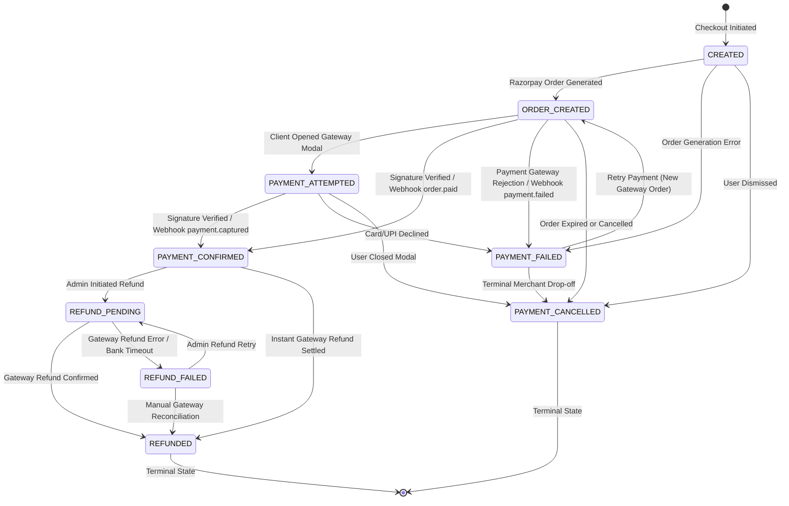

# PRACHAR — PAYMENT STATE MACHINE SPECIFICATION
## Transaction & Advertisement Payment Lifecycle Engine

**Document:** `docs/PAYMENT_STATE_MACHINE.md`  
**System:** PRACHAR (Phygital Publicity Platform)  
**Version:** Phase 8 Production Hardening  
**Status:** ACTIVE & ENFORCED  

---

## 1. Overview & Architectural Principles

The PRACHAR Payment Engine governs the entire financial lifecycle of print advertisements, digital profile subscriptions, and NFC-linked promotional campaigns. In accordance with zero-trust financial architecture:

1. **State Machine Validation:** Direct status mutation is strictly forbidden. Status transitions must pass domain validation defined in `PaymentTransactionStatus.canTransitionTo()`.
2. **Strict Decoupling of Editorial from Financial Workflows:** 
   - `PaymentStatus` reflects monetary settlement.
   - `AdvertisementStatus` reflects print editorial proofing and scheduling.
   - Payment confirmation (`PAYMENT_CONFIRMED`) advances an ad's payment status, but leaves `Advertisement.status` in `SUBMITTED`. No advertisement is ever automatically approved or published upon payment receipt.
3. **Descheduling Safety Guard:** If a published or scheduled advertisement is refunded, the system automatically transitions the advertisement status back to `APPROVED` or deschedules it from publication, preventing publication of refunded campaigns.
4. **Idempotent Self-Transitions:** Transitioning from status $S$ to status $S$ is valid and idempotent.

---

## 2. Payment Transaction State Machine Diagram



---

## 3. Valid State Transitions Table

| Current State (`this`) | Allowed Target States (`target`) | Terminal? | Notes |
|:---|:---|:---:|:---|
| `CREATED` | `ORDER_CREATED`, `PAYMENT_FAILED`, `PAYMENT_CANCELLED` | No | Initial entity construction |
| `ORDER_CREATED` | `PAYMENT_ATTEMPTED`, `PAYMENT_CONFIRMED`, `PAYMENT_FAILED`, `PAYMENT_CANCELLED` | No | Gateway order ID assigned |
| `PAYMENT_ATTEMPTED` | `PAYMENT_CONFIRMED`, `PAYMENT_FAILED`, `PAYMENT_CANCELLED` | No | In-flight gateway transaction |
| `PAYMENT_CONFIRMED` | `REFUND_PENDING`, `REFUNDED` | No | Fund captured; receipt generated |
| `REFUND_PENDING` | `REFUNDED`, `REFUND_FAILED` | No | In-flight gateway refund call |
| `PAYMENT_FAILED` | `ORDER_CREATED`, `PAYMENT_CANCELLED` | No | Allows retry with new order |
| `REFUND_FAILED` | `REFUND_PENDING`, `REFUNDED` | No | Allows admin refund retry |
| `REFUNDED` | *None* | **Yes** | Terminal financial state |
| `PAYMENT_CANCELLED` | *None* | **Yes** | Terminal cancellation state |

*Note: Any status transitioning to itself (`S.canTransitionTo(S)`) evaluates to `true` to ensure idempotency across asynchronous webhooks and concurrent client calls.*

---

## 4. Entity-Level Transition Guard

Implemented in `com.prachar.payment.PaymentTransaction`:

```java
public void transitionTo(PaymentTransactionStatus target) {
    if (!this.status.canTransitionTo(target)) {
        throw new IllegalStateException("Illegal payment status transition from " + this.status + " to " + target);
    }
    this.status = target;
}
```

Any attempt to execute an invalid transition (e.g., `ORDER_CREATED -> REFUNDED` or `REFUNDED -> PAYMENT_CONFIRMED`) throws an `IllegalStateException`, halting database persistence and rolling back the transaction.

---

## 5. Bidirectional Synchronization: `PaymentTransaction` vs `Advertisement`

| `PaymentTransaction.status` | Associated `Advertisement.paymentStatus` | Associated `Advertisement.status` Impact |
|:---|:---|:---|
| `CREATED` | `PAYMENT_PENDING` | Unchanged |
| `ORDER_CREATED` | `PAYMENT_INITIATED` | Unchanged |
| `PAYMENT_ATTEMPTED` | `PAYMENT_INITIATED` | Unchanged |
| `PAYMENT_CONFIRMED` | `PAYMENT_CONFIRMED` | Set `paidAt = now()`, `paymentReference = paymentId`; `status` remains `SUBMITTED` |
| `PAYMENT_FAILED` | `PAYMENT_FAILED` | Unchanged |
| `PAYMENT_CANCELLED` | `PAYMENT_FAILED` | Unchanged |
| `REFUND_PENDING` | `PAYMENT_CONFIRMED` (in-flight) | Unchanged |
| `REFUNDED` | `PAYMENT_REFUNDED` | If `Advertisement.status == SCHEDULED`, deschedule to `APPROVED` |
| `REFUND_FAILED` | `PAYMENT_CONFIRMED` | Unchanged; flags administrative alert |

---

## 6. Editorial Safeguards

1. **Pre-requisite for Print Scheduling:**
   In `AdminAdvertisementService.java`:
   ```java
   case "SCHEDULE" -> {
       if (ad.getStatus() != AdvertisementStatus.APPROVED) {
           throw new IllegalStateException("Only APPROVED advertisements can be scheduled for publication.");
       }
       if (ad.getPaymentStatus() != PaymentStatus.PAYMENT_CONFIRMED) {
           throw new IllegalStateException("Advertisement cannot be scheduled without confirmed payment. Current payment status: " + ad.getPaymentStatus());
       }
       ad.setStatus(AdvertisementStatus.SCHEDULED);
       ad.setScheduledAt(Instant.now());
   }
   ```
2. **Automatic Descheduling on Refund:**
   In `PaymentService.java`:
   ```java
   if (ad.getStatus() == AdvertisementStatus.SCHEDULED) {
       ad.setStatus(AdvertisementStatus.APPROVED);
       log.info("[REFUND_DESCHEDULED] Descheduled advertisement {} due to refund", ad.getId());
   }
   ```
